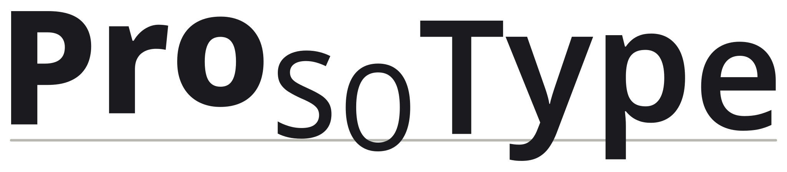

<h1><picture><source media="(prefers-color-scheme: dark)" srcset="docs/img/logo-dark.svg"></picture></h1>

Speech written in the International Phonetic Alphabet, with how it was said (pitch, length and loudness) set into the type itself.

**Site:** https://omnifroodle.github.io/prosotype/

ProsoType has three parts:

1. **A data model.** Utterances, words and IPA phones, where each phone carries pitch (semitones from the speaker's median), duration and loudness (dB from the speaker's mean).
2. **A packed stream.** One fixed-width symbol per phone: 6 bits name the phone and the remaining 2, 6 or 10 bits carry delivery. The 8- and 12-bit variants with a word-start flag come out smaller than plain text.
3. **A standard visual mapping.** Pitch is shown as glyph height, duration as width and loudness as weight, in one variable font.

This repository holds the output of the viability phase:

| Path | What |
|---|---|
| [SPEC.md](SPEC.md) | The specification (draft 0.2), including measured findings and a go / adjust / stop call |
| [PLAN.md](PLAN.md) | The plan and the decisions this phase worked from |
| [prototype/](prototype) | Python prototype: `pack.py`, `render.py`, `transcribe.py`, `bitrate.py`, `site.py` |
| [vectors/](vectors) | Conformance test vectors for the packed stream (SPEC.md §3.10) |
| [js/](js) | An independent decoder in JavaScript, written from the spec, and its vector test |
| [docs/](docs) | The GitHub Pages site, built by `prototype/site.py`; logo by `prototype/logo.py` |

Status: technical viability looks good, with adjustments (SPEC.md §9.5). Everything reproduces with `cd prototype && uv sync && uv run reproduce.py`. Fluent reading of IPA is a known limitation that is deliberately deferred.

The evidence comes from one speaker. Their source recordings are not published; their transcriptions (`prototype/samples/*.json`) are. The project was developed under the working name Shadowcat.

## Licence

- **Code** (everything under `prototype/` that is a program, including `site.py`) is under the [MIT License](LICENSE).
- **The specification and other written and visual material** are under [Creative Commons Attribution 4.0 International](LICENSE-CC-BY-4.0.txt) (CC BY 4.0). That covers [SPEC.md](SPEC.md), [PLAN.md](PLAN.md), the READMEs, the site in `docs/` (text, screenshots and renders) and the sample data in `prototype/samples/`. Attribute it as: *ProsoType specification, Matt Overstreet, CC BY 4.0*.
- **Third-party material:**
  - The rendered pages embed a subset of [Noto Sans](https://fonts.google.com/noto/specimen/Noto+Sans), which is under the [SIL Open Font License 1.1](https://openfontlicense.org) and is not covered by either licence above.
  - The CMU Pronouncing Dictionary and the models are downloaded at setup and not redistributed here.
